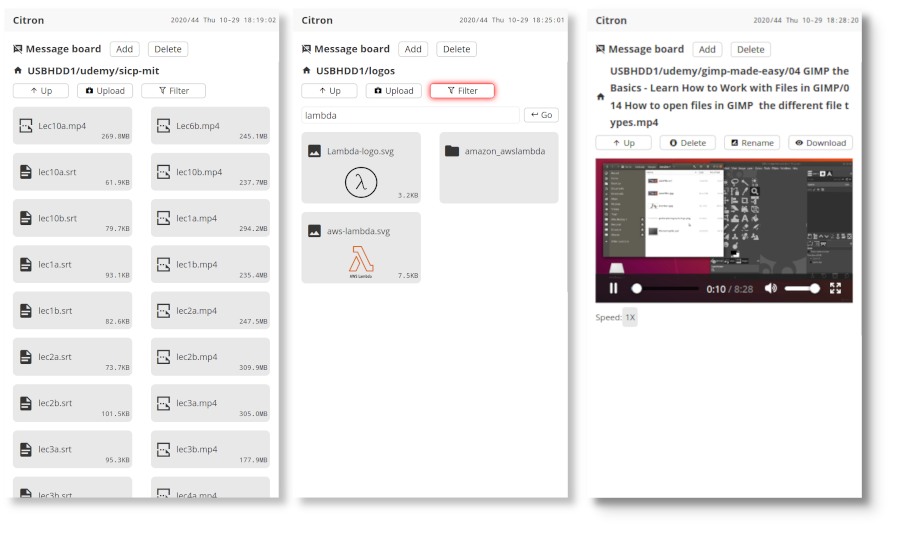

# citron

A file server written in Clojure/ClojureScript. Features:

* Direct video play (currently only mp4 format supported) with option to adjust playback speed.
* Audio play and playlist
* Image preview
* File filter





# How to build

* Install leinigen first.
* Clone citron and citron-web projects,

``` bash
git clone https://github.com/cassc/citron
git clone https://github.com/cassc/citron-web
```

* Create symlink, 

``` bash
cd citron/resources
ln -s ../../citron-web/resources/public public
```

* Build standalone `jar` package:

``` bash
cd citron
make build
```

* Run the standlone jar file as a Java application: 

```bash
CITRON_USERNAME=myusername \
CITRON_PASSWORD=mypassword \
CITRON_FILE_ROOT=/home \
CITRON_MAX_PREVIEW_SIZE=1024 \
CITRON_LOG_FILE=citron.log \
CITRON_LOG_LEVEL=info \
CITRON_IP=0.0.0.0 \
CITRON_PORT=8080 \
java -server -XX:MaxMetaspaceSize=128m -Xms128m -Xmx128m -jar target/citron-*-standalone.jar
```

Open http://localhost:8080 in your browser.

# Environmental options

* 'CITRON_USERNAME' sets username.
* 'CITRON_PASSWORD' sets password.
* 'CITRON_FILE_ROOT' set root directory to serve.
* 'CITRON_MAX_PREVIEW_SIZE' sets the maximum file size to display in browser. 
* 'CITRON_LOG_FILE' sets the log file path.
* 'CITRON_LOG_LEVEL' sets the log level, valid values are `debug`, `info`, `warn`.
* 'CITRON_IP' sets IP to bind, e.g, `192.168.1.123`. 
* 'CITRON_PORT' sets the port to bind.

